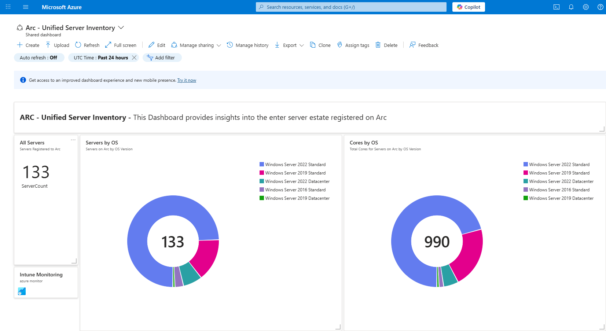

# Azure Arc Dashboards

## Overview
This repository contains a collection of **Azure Arc dashboard templates** in JSON format.  
These dashboards can be imported into the **Azure portal** to provide visibility and insights into your Arc-enabled environment, including servers, SQL workloads, and Defender integration.

The dashboards are designed to help IT administrators monitor and manage **hybrid and multi-cloud resources** connected to Azure Arc.

---

## Dashboards Included

1. **Arc - Defender Overview.json**  
   Security posture overview of Arc-enabled resources. Integrates with Microsoft Defender for Cloud.

2. **Arc - Estate Profile.json**  
   High-level summary of your Arc estate, including resource distribution.

3. **Arc - ESU Tracker.json**  
   Tracks **Extended Security Updates (ESU)** for Windows Servers connected via Arc.

4. **Arc - Linux Servers.json**  
   Focused dashboard for Arc-enabled **Linux servers**.

5. **Arc - Rollout Progress Tracker.json**  
   Tracks adoption and rollout of Azure Arc resources.

6. **Arc - SQL Server Inventory.json**  
   Inventory of Arc-enabled **SQL Server instances**.

7. **Arc - Unified Server Inventory.json**  
   Combined inventory of all Arc-enabled servers (Windows + Linux).

8. **Arc - Windows Servers.json**  
   Dashboard for Arc-enabled **Windows servers** with health and performance insights.

---

## How to Import Dashboards

1. Go to the **[Azure Portal](https://portal.azure.com/)**.
2. Navigate to:  
   **Azure Portal → Dashboard → Upload**
3. Click **Upload** and select the desired `.json` file from this repository.
4. Once uploaded, the dashboard will be available under **Private dashboards**.
5. Optionally, click **Share** to publish it for your team.

📸 Example: Uploading a dashboard in the Azure Portal  

---

## Notes
- Ensure your Arc-enabled resources are properly onboarded.
- Some dashboards require additional Azure services (e.g., Defender for Cloud, SQL assessment solutions).
- You can customize filters (subscription, resource group, tags) to adapt the dashboards to your needs.

---

## License
This project is licensed under the [MIT License](https://opensource.org/licenses/MIT).

---

**Author**: Mohammed Omar  
**Website**: [momar.tech](https://momar.tech)  
**Date**: May 29, 2025
